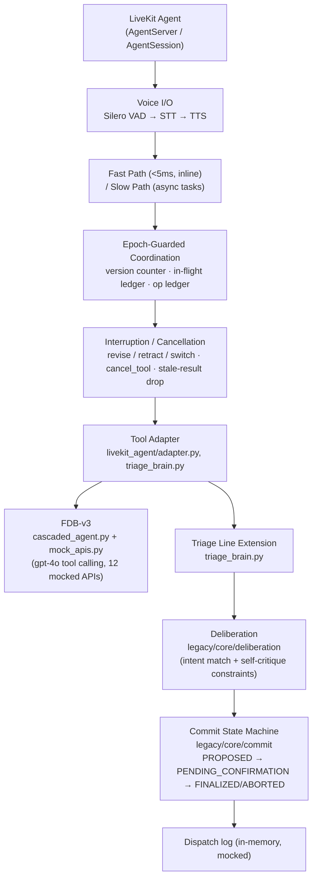

# Architecture

This diagram reflects what is actually implemented, across all three
pieces described in the top-level `README.md` (A: internal harness,
B: FDB-v3 integration, C: Triage Line extension). B and C share the same
LiveKit agent shell and the same fast/slow-path + epoch-guard coordination
pattern; they diverge only at the Tool Adapter layer.

## Notes on what maps to what

- **LiveKit Agent / Voice I/O**: real for B and C's entrypoints
  (`livekit_agent/cascaded_agent.py`, `livekit_agent/triage_livekit_agent.py`)
  — Silero VAD, OpenAI Whisper STT, OpenAI TTS. **Not run against a live
  room in this environment** (no network/credentials) — see the readiness
  report.
- **Fast/Slow Path + Epoch-Guarded Coordination + Interruption/Cancellation**:
  this is `agent/agent.py`'s `ParticipantAgent` (piece A, the internal
  harness) — `version` bump on invalidation, in-flight ledger keyed by
  `call_id`, targeted `cancel_tool`, operation ledger for dedup. This is
  the SAME logic `livekit_agent/adapter.py` reuses unmodified for B (see
  that file's own "no interruption logic of its own" docstring) — it is
  not reimplemented per transport.
- **Tool Adapter**: `livekit_agent/adapter.py` (FDB-v3 path, wraps
  `ParticipantAgent`) and `livekit_agent/triage_brain.py`
  (`TriageBrainLLM`, the Triage Line path) are two separate adapters
  behind the same LiveKit shell — this is the fork point the diagram
  shows as "Tool Adapter ↙↘".
- **FDB-v3 branch**: `cascaded_agent.py` + `mock_apis.py`, gpt-4o doing
  its own tool calling against 12 mocked travel/finance/housing/e-commerce
  APIs. No deliberation/commit layer here — that machinery is Triage
  Line-only.
- **Deliberation / Commit State Machine**: `legacy/core/deliberation/`
  and `legacy/core/commit/` — intent handlers + self-critique constraints,
  then `PROPOSED → PENDING_CONFIRMATION → FINALIZED/ABORTED`, unmodified
  from Phases 1–5 except one location-extraction recency fix (see
  `legacy/docs/EXTENSION_DEMO_TRANSCRIPT.md`).
- **Dispatch**: an in-memory log (`TriageBrainLLM._log_dispatch`), not a
  real dispatch/CAD/emergency-services integration.

## Identifiers

- **LiveKit**: `livekit-agents` SDK (`AgentServer`/`AgentSession`), version
  pin attempted `~=1.3`, resolved to `1.8.3` when previously installed
  per `livekit_agent/SETUP.md`; not installed in this sandbox (no PyPI egress).
- **FDB-v3**: Full-Duplex-Bench, `v3` directory — github.com/DanielLin94144/Full-Duplex-Bench.
- **Model/provider**: Silero VAD; OpenAI `whisper-1` (STT), `gpt-4o` (LLM,
  FDB-v3 path only), `tts-1` (TTS). The internal harness (A) and the
  Triage Line brain (C) use no LLM — rule-based NLU / regex extraction.
- **Reproduction command (B)**: `./run_fdb_v3.sh`.
- **Reproduction command (A)**: `python run_local.py --all --agent agent.agent:ParticipantAgent`.
- **Reproduction command (C)**: `python3 livekit_agent/adapter_tests/test_4_triage_line_interruption.py`.
