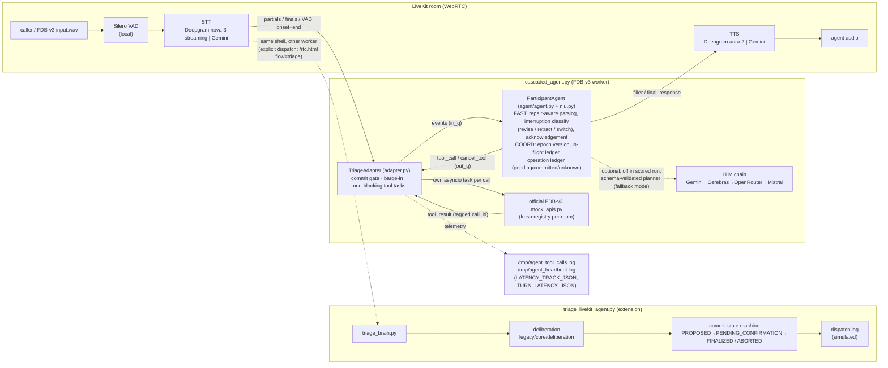

# Architecture

One LiveKit agent shell, two call flows:

- **FDB-v3 worker** (`livekit_agent/cascaded_agent.py`, scored 60%) - the custom cascaded voice agent the
  organisers re-run with `./run_fdb_v3.sh`.
- **Triage Line** (`livekit_agent/triage_livekit_agent.py`, the extension use case, scored 20%) - roadside /
  incident triage with deliberation and a two-phase commit of simulated actions.

Both flows use the same pattern: a fast path that never blocks, a slow path that runs as background tasks,
and an epoch (version) guard that drops stale work.

```mermaid
flowchart LR
    subgraph Room["LiveKit room (WebRTC)"]
      MIC["caller / FDB-v3 input.wav"] --> VAD["Silero VAD<br/>(local)"]
      VAD --> STT["STT<br/>Deepgram nova-3 streaming | Gemini"]
      TTS["TTS<br/>Deepgram aura-2 | Gemini"] --> SPK["agent audio"]
    end

    STT -- "partials / finals / VAD onset+end" --> ADP
    subgraph Worker["cascaded_agent.py (FDB-v3 worker)"]
      ADP["TriageAdapter (adapter.py)<br/>commit gate · barge-in · non-blocking tool tasks"]
      ADP -- "events (in_q)" --> PA
      PA["ParticipantAgent (agent/agent.py + nlu.py)<br/>FAST: repair-aware parsing, interruption classify<br/>(revise / retract / switch), acknowledgement<br/>COORD: epoch version, in-flight ledger,<br/>operation ledger (pending/committed/unknown)"]
      PA -. "optional, off in scored run:<br/>schema-validated planner (fallback mode)" .-> LLM["LLM chain<br/>Gemini→Cerebras→OpenRouter→Mistral"]
      PA -- "tool_call / cancel_tool (out_q)" --> ADP
      ADP -- "own asyncio task per call" --> MOCK["official FDB-v3 mock_apis.py<br/>(fresh registry per room)"]
      MOCK -- "tool_result (tagged call_id)" --> ADP
      PA -- "filler / final_response" --> TTS
    end
    ADP -. "telemetry" .-> LOG["/tmp/agent_tool_calls.log<br/>/tmp/agent_heartbeat.log<br/>(LATENCY_TRACK_JSON, TURN_LATENCY_JSON)"]

    subgraph Ext["triage_livekit_agent.py (extension)"]
      TB["triage_brain.py"] --> DEL["deliberation<br/>legacy/core/deliberation"] --> CM["commit state machine<br/>PROPOSED→PENDING_CONFIRMATION→<br/>FINALIZED / ABORTED"] --> DSP["dispatch log<br/>(simulated)"]
    end
    STT -. "same shell, other worker<br/>(explicit dispatch: /rtc.html flow=triage)" .-> TB
```

## Fast path, slow path, coordination

| Layer | What it does | Where |
|---|---|---|
| Fast path (inline, < 5 ms) | parse the running transcript (self-repair aware: the value after the last correction wins), classify a barge-in as revise / retract / intent switch, speak an acknowledgement, cut agent speech on VAD onset or a correction cue in a partial | `agent/agent.py` `on_turn`, `on_interruption`; `livekit_agent/adapter.py` `on_user_speech_start`, `on_user_partial` |
| Slow path (background tasks) | every tool call is its own `asyncio.Task`; STT, TTS and the optional planner never block the event consumer | `adapter._run_tool`, `agent.llm_fallback` |
| Coordination | `version` is bumped on every invalidation; results carry the call's version / `call_id` and are dropped if stale; results are re-validated against the slots they depended on (`still_valid`) | `agent.invalidate`, `agent.on_tool_result` |
| State-change safety | operation ledger per idempotency key: never a duplicate commit, never an automatic retry of an unknown outcome, late results reconciled truthfully | `agent/ledger.py`, `agent.on_late_result` |

## Turn taking and the commit gate

LiveKit endpointing (VAD min 0.5 s) plus the semantic turn detector (`livekit-plugins-turn-detector`,
weights pre-downloaded by `run_fdb_v3.sh` stage 1 / the Dockerfile) decide end of turn. The adapter's commit
gate only merges fragments that the endpointer split: it commits `TRIAGELINE_SETTLE_S` (benchmark 1.0 s)
after the last final, or `TRIAGELINE_MAX_SETTLE_S` (2.0 s) when the running transcript still looks unfinished
(dangling connective, or the top-ranked tool is missing a required argument).

A VAD onset **re-arms** the timer with the long wait. It never just cancels it, so a breath, a click, or an
STT that returns "" for noise cannot strand a finished request. An empty final or the end of the speech
segment restarts the normal wait.

A short backchannel ("Mm-hm.") is spoken once per substantive user turn while the gate settles. It is logged
as `first_audio_s`, **not** as the response: `substantive_s` / `response_s` and the official
`LATENCY_TRACK_JSON` are stamped on the first substantive line.

## Multi-step requests

A turn is split into clause groups (`split_compound`). Tool-less fragments attach to a neighbour. A trailing
fragment that only **adds** arguments to the same request (a budget, a mode) is merged into it. A fragment is
split off only when it gives a **new value for the same main argument** (two filters, two items). Clauses run
one at a time. A later clause binds reference fields (ids, addresses) from the previous step's result, and a
search filter committed earlier in the session fills the same-named search argument. Conditions ("if it's
under 50") are evaluated against the actual latest result.

In benchmark mode (FDB-v3 template: never ask), a **read-only** lookup with a missing argument is still issued
with what is known. A **state-modifying** call is never sent without its required arguments.

## LLM planner (optional)

`TRIAGELINE_LLM_MODE=fallback` (default in benchmark mode): rules first; the planner is consulted only when
the rules cannot build a complete call. `primary` (default for the phone assistant): planner first, rules as
fallback. Every proposed call is schema-validated (types, enums, bounds, required args). A multi-step plan is
executed **in order, one call at a time** under the same epoch/ledger gates, and an interruption discards the
rest. `run_fdb_v3.sh` pins `TRIAGELINE_LLM_PLANNER=0` for the scored run, so it is rules-only and
deterministic given the transcript.

## Cancellation trade-off

- A **read-only** call superseded by a correction is cancelled for real (its task is cancelled).
- A **state-modifying** call that has **not been dispatched yet** (its task has not started running) is also
  cancelled for real. No side effect is possible and it never reaches the tool log, and the ledger records the
  cancel as confirmed.
- A **state-modifying** call that was already dispatched is left to finish. Its late outcome is reconciled by
  the operation ledger ("the earlier booking had already gone through…") instead of being silently lost. This
  is the truthful policy for a real backend. The cost is that the FDB-v3 tool log can contain a superseded
  state change if the correction lands after dispatch.

## Per-room isolation

A fresh `MockAPIRegistry`, `TriageAdapter` and `ParticipantAgent` are created per room. The LLM provider
cooldown/status is reset at room start, so no state or cache crosses scenarios.

## Extension: Triage Line

`triage_livekit_agent.py` runs the legacy dialogue → deliberation → commit stack (`legacy/core/`) via
`triage_brain.py`. Consequential actions (tow dispatch, emergency escalation) go
`PROPOSED → PENDING_CONFIRMATION` and only finalize on an explicit "yes". A caller correction mid-prompt aborts
the stale action and re-deliberates. `force_resolve_pending()` on every teardown path guarantees nothing is
left non-terminal. The gateway routes a call here when `/rtc.html` "Call type" is *Triage Line* (a closed
`flow=triage` choice mapped to `TRIAGELINE_TRIAGE_AGENT_NAME`). All actions are simulated.

## Identifiers

`livekit-agents==1.8.3` (+ openai, silero, deepgram, turn-detector plugins 1.8.3), Python 3.10-3.12,
FDB-v3 commit `3e799c45a045256f47d5f1c9cda90157e2d2ec9e` (official `mock_apis.py` / `latency_injector.py`
byte-identical, copied at run time).
